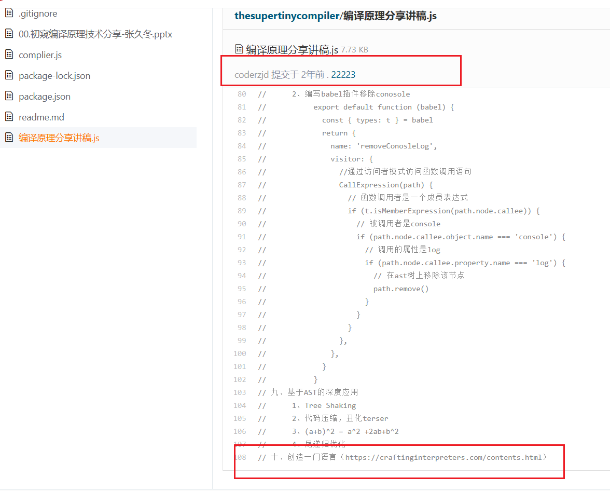

### 创造一门编程语言在今天来看似乎不是很流行了

+ 故事的开始还得从2年前说起
+ 彼时我主讲过一个分享会
+ 主题是:初窥编译原理
+ 从​the-super-tiny-compiler开始
+ 介绍babel原理与使用
+ 用​astexplorer展示AST与应用
+ ​但是我的讲稿还设计了一章
+ 创造一门语言: Crafting Interpreters
+ 当时练习时长太短，没敢讲
+ 今天终于鼓起勇气再介绍一遍

### Crafting Interpreters介绍
1. 定义lox语言规则
2. java实现jlox
3. c实现字节码、VM

### 学会创造一门编程语言的基础
1. 了解一些编译原理基础概念BNF
2. 熟悉一些静态语言和动态语言
3. 本书主要基于Java和c基础实现
   
### 在这里你会接触到
1. scanner把字符流变 Token 流
2. parser沿着CFG去递归下降
3. Interpreter如何执行代码
4. 了解函数运行上下文与闭包
5. vscode是怎么发现return之后的dead code
6. 手写面向对象
7. ……
8. 不剧透了，祝各位玩得开心

### 最后还有些资料
+ [编译原理: 哈工大公开课](https://www.bilibili.com/video/BV1dL4y1H7T8/)
+ [原始文档](https://craftinginterpreters.com/dedication.html)
+ [翻译文档](https://readonly.link/books/https://raw.githubusercontent.com/GuoYaxiang/craftinginterpreters_zh/main/book.json/-/3.Lox%E8%AF%AD%E8%A8%80.md#34-expressions)
+ [Bob Nystrom's 博客](https://journal.stuffwithstuff.com/archive/)
+ [Bob's 游戏编程模式](https://gameprogrammingpatterns.com/)
+ [Bob's magpie](https://magpie-lang.org/)
+ [当前进度](https://readonly.link/books/https://raw.githubusercontent.com/GuoYaxiang/craftinginterpreters_zh/main/book.json/-/25.%E9%97%AD%E5%8C%85.md#252-upvalues)